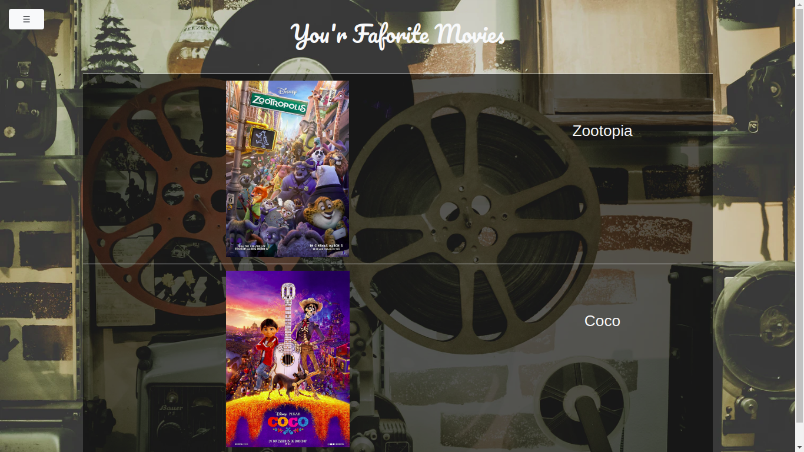

# Movie & Tv Series Web App

## Home Page ( Halaman awal App)
* Background
> Penggunaan Backgorund gambar Piringan musik walas dan juga alat perekan Video walas untuk menunjukan rasa Jaman dulu dan lebih clasik dan beberapa barang lain yang tidak berhubungan dengan App ini, meskipun begitu tampilan awal telah sedikit menggambarkan Web ini menyajikan apa, meskipun tidak Style seperti ini sudah jarang di gunakan karena kebanyakan web di disain sekarang lebih Clean dan aesthetic tamppa menggunakan banyak warna.
* Navigation
> Penggunaan 2 gambar yaitu gambar Clapper Board untuk dapat di artikan sebagai Movie dan Gambar Tv sebagai perngartian dari Tv Series, 2 Prodak ini lah yang di sajikan pada web app ini, untuk mempertegas dari maksud gambar tersebut maka saat di Hover akan muncul Tulisan Movie ataupun Tv Series. Penggunaan warna Background saat di hover di sesuaikan dekan Tema Clasik pada Backgrond Page.

## Nav Bar
> Tombol NavBar yang hanya kecil di Pojok kiri atas dan di beri Burger agar sedikit lebih kalem atau tidak begitu mencolok tp masih tetap dapat terlihat meskipun tampa warna atau gambar yang mencolok, dan pada saat di clik akan mengeluarkan opsi yang ada pada Navigatin tersebut.

## Add Page (Movie / Tv Series)
> Add Movie atau Tv Series dapat ditemukan pada Navbar, jika ingin menambahkan Tv series makan harus masuk pada halaman Tv series terlebih dahulu dan begitu jg dengan Movie, Penggunaan Form untuk memasukan data akan mempermudah user dalam memasukkan data yang ia inginkan, penggunaan plesholder agar memberi Title pada text input yang di sediakan, dan ditambah dengan jika url gambar yang dinginkan telah di masukan maka gambar akan langsung ke render dan jika salah maka user dapat mengetahuinya langsung.

## Edit Page (Movie / Tv Series)
> Edit page Movie dan Tv seris sangat sama dengan background yang sama dengan homa page di awal, dengan form input yang sederhana dan telah terisi oleh data yang sesuai dengan data movie maupun tv series yang akan di edit dan tak lupa link dari gambar akan langsung ke render pada saat page terbuka sesuai dengan link pada data yang di pilih untuk di edit, dengan background hintam trasparan yang membuat gambar dan form text dapat terpisah dengan rapi.

## Favorites Page (Movie / Tv Series)
> Favorites page dapat di akses melalu NavBar, Favorites Movie dan Tv Series di pisah, dahn data yang akan di tampilkan sesuai pada saat user membuka atau mengklik favorites page pada navbar. data yang di tampilkan pada Favorites page berupa dable yang berisikan Gambar dari data yang di Favorite kan dan nama dari data tersebut dan di berikan background hitam agar tulisan di dalam table dapat terlihat lebih jelas.

## Movie Page (Halaman Movie)
* Background
> Menggunakan Background gambar hutan pada sebuah pegunungan yang berembun dan berwarna yang sama dengan warna warna yang ada pad Home page, gambar pada Page ini lebih kepada tampilan tenang karna alam dan gambar yang tidak begitu banyak memiliki gambar yang terlalu terang agar Component Card pada movie/Tv Series tetap manjadi object yang lebih di tonjolkan.
* Card
> Card Movie yang dengan background Hitam tansparan agabertujuan agar warna trasparan dapan mudah beradaptasi dengan background di balakang agar tidak terlalu mencolok dan gambar cover dari Movie agar dapat terlihat lebih cerah maka dari itu di beri Background hitam dan backround page yang lebih berwarna redup atau tidak terlalu cerah, dan dilengkapi dengan Tombol warna warni agar terlihat lebih mencolok, penggunaan icon text penjelasan fungsi dari tombol tersebut diahrapkan user akan mudah memahami dari maksud tombol tersebut.

## TV Series Pahe (Halaman Tv Series)
* Background
> Menggunakan ganmbar air danau atau laut yang sedang bergenang dangen warna hitam yang lebih dominan agar card tamoak lebih jelas, dan maksud penggunaan air pada danau atau pun laun bermaksud pada luas atau Tv series biasanya akan berdurasi lebih lama dan cangkupan yang di sajikannya pun maka akan lebih luar dibandingkan movie.
* Card
> Card pada Tv Series sama dengan Movie.
